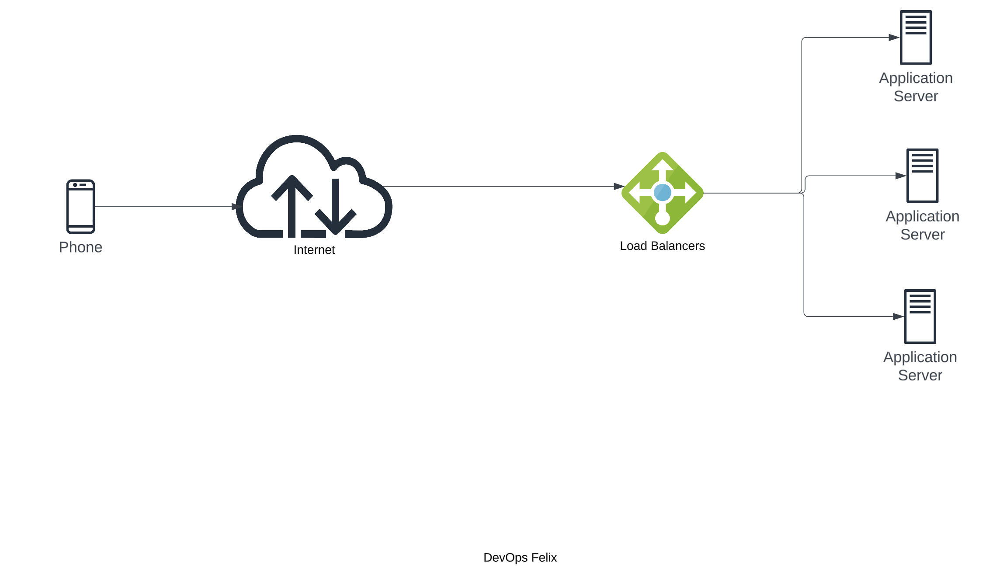
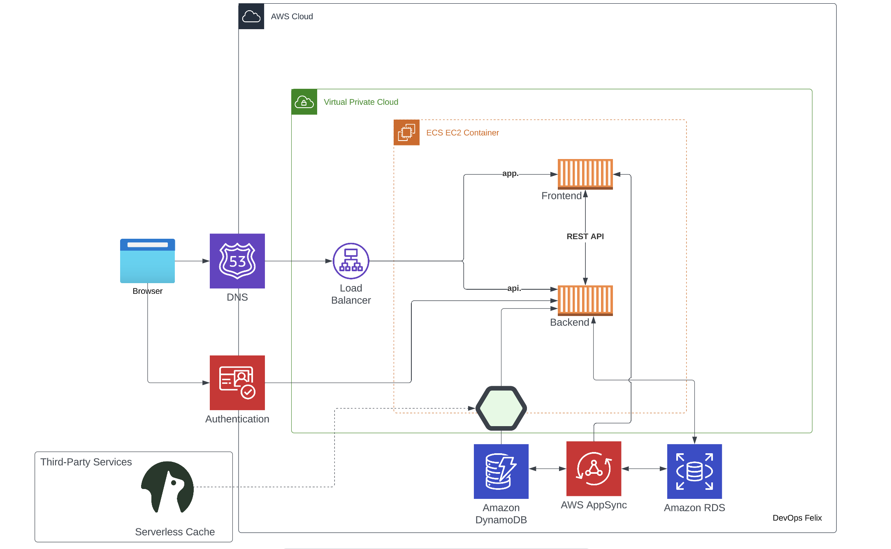
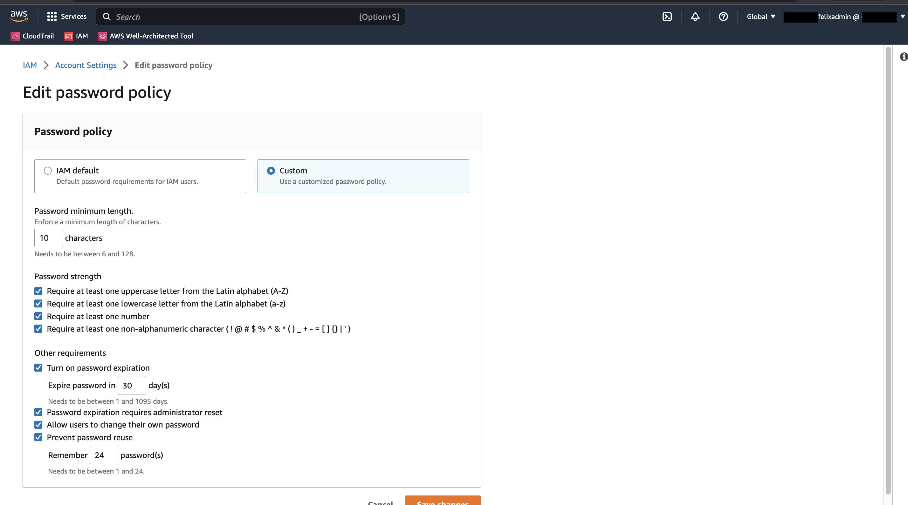

# Week 0 — Billing and Architecture

## Required Homework

- ### Recreate Conceptual Diagram in Lucidchart

[View Conceptual Diagram on Lucidchart](https://lucid.app/lucidchart/9cb9392e-ab3a-4e53-8f16-c596915ca900/edit?viewport_loc=22%2C312%2C1516%2C875%2C0_0&invitationId=inv_ac87ca6d-8003-4050-bf67-c341a4758288)

- ### Recreate Logical Architectual Diagram in Lucidchart

[View Logical Architectural Diagram on Lucidchart](https://lucid.app/lucidchart/e471f916-7b0e-4c07-bc98-6b773b646997/edit?viewport_loc=-338%2C113%2C2133%2C1231%2C0_0&invitationId=inv_d00fae29-b1ee-46d9-8116-46a036fd1cc7)
  
- ### Create Admin User with MFA turned on

**insert image**
  

- ### AWS CLI installation

Installation done on Gitpod via a Linux instance ([YAML File run upon instance launch](../../../blob/main/.gitpod.yml))

  
- ### Create Billing Alarm
programmatically and via console
***Insert screenshot***

- ### Create a Budget
programmatically and via console
***Insert screenshot***

  

  
## Homework Challenges

 - Set up custom password policy: This is to minimize the use of root user account to reset IAM User passwords. Also, I enabled 'Allow users to change their own password', and only after password expiration within 30 days that I will have to use the root user account if IAM user forgets to rotate their password.
 

- Review the AWS Well-Architected Tool 

- Explore Access Advisor:  This will allow me to keep tabs on IAM Users to fine-tune assigned policies to follow the least-privilege principle should I have other users other than the admin IAM user.

- Research technical and service limits of resources allocated under the [AWS Free Tier](https://aws.amazon.com/free/?all-free-tier.sort-by=item.additionalFields.SortRank&all-free-tier.sort-order=asc&awsf.Free%20Tier%20Types=*all&awsf.Free%20Tier%20Categories=*all)

- [AWS Pricing Calculator](https://calculator.aws/#/addService): Use AWS Pricing Calculator to get an estimate of the cost of resources bearing in mind that the pricing calculator generates estimates using 730 hours/month.
