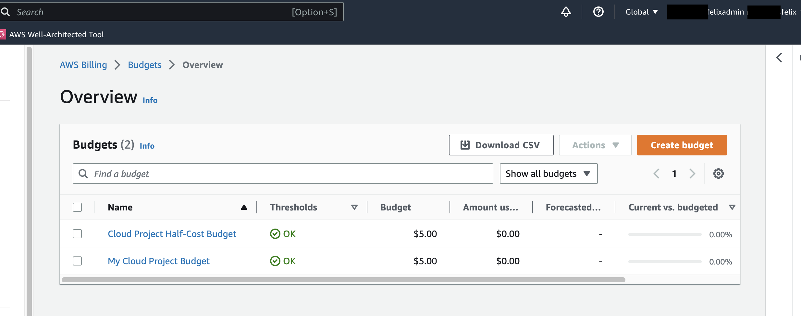

# Week 0 — Billing and Architecture


## Required Homework

- ### Recreate Conceptual Diagram in Lucidchart


[View Conceptual Diagram on Lucidchart](https://lucid.app/lucidchart/9cb9392e-ab3a-4e53-8f16-c596915ca900/edit?viewport_loc=22%2C312%2C1516%2C875%2C0_0&invitationId=inv_ac87ca6d-8003-4050-bf67-c341a4758288)


- ### Recreate Logical Architectual Diagram in Lucidchart


[View Logical Architectural Diagram on Lucidchart](https://lucid.app/lucidchart/e471f916-7b0e-4c07-bc98-6b773b646997/edit?viewport_loc=-338%2C113%2C2133%2C1231%2C0_0&invitationId=inv_d00fae29-b1ee-46d9-8116-46a036fd1cc7)
  
- ### Create Admin User with MFA turned on


  

- ### AWS CLI installation

Installation done on Gitpod via a Linux instance ([YAML File run upon instance launch](../../../blob/main/.gitpod.yml))

  
- ### Create Billing Alarm
	### Point-and-Click Via AWS Console (2 ways)
	
 1. Via the CloudWatch Management Console
     - Click on ***Billing Preferences*** on the sidebar menu of your Billing Dashboard; check the appropriate checkboxes and click on the hyperlink ***Manage Billing Alerts.*** This takes you to the **CloudWatch Management Console**.
     - To the left of the console, click on ***Alarms*** and ***Create Alarm***. It is worth noting that Billing metric data is stored in the **US East (N. Virginia) Region** and represents worldwide charges.
     - Fill out the form and configure notification action as to when you want the alarm to be triggered in either of **3 states (In Alarm, OK, Insufficient Data).** 
     - When alarm is triggered, you need to have an SNS topic or you can create one as you fill out the form
     - Note that with the **AWS Free Tier**, you have **only 10 alarms** at your disposal.


 2. Via the Budgets (Alarm bundled with budget)
     - Click on ***Budgets*** on the left side of the ***Billing Dashboard*** and select ***Create Budget***. This is a **Global Service** so region defaults to Global
     - You can create **2 free budgets** under the **AWS Free Tier**
     - Follow the budget setup prompts; for easy setup, select ***use a template(simplified).*** 
     - You can create a **zero spend budget** where you’re alerted when your **spending exceeds $0.01 above free tier limits**
     - For monthly cost budget, you can set your budget amount and you’ll get notified when actual spend reaches 85 and 100% and if your forecasted spend is expected to reach 100%

### Programmatically via AWS CLI
  - Using the AWS Command Reference as a guide, setting billing alarms requires the use of the AWS CloudWatch API. The commands below were used to create a billing alarm.
	  
  - [CloudWatch Put Metric Alarm Reference](https://docs.aws.amazon.com/cli/latest/reference/cloudwatch/put-metric-alarm.html):
      ```bash
      aws cloudwatch put metic-alarm —cli-input-json file://aws/json/alarm-config.json
      ```
      The JSON files referenced in code above can be viewed here:
      - [file://aws/json/alarm-config.json](../../../blob/main/aws/json/alarm-config.json)
    

- ### Create a Budget
	- Point-and-Click Via AWS Console
	  - Always set your budget up before spinning resource 
	  


- Programmatically via AWS CLI
  - Using the AWS Command Reference as a guide, setting billing alarms requires the use of the AWS Budgets API. The commands below were used to create a budget and billing alarm.
	  
  - [Budget Creation](https://docs.aws.amazon.com/cli/latest/reference/budgets/create-budget.html#examples):
      ```bash
      aws budgets create-budget \
      --account-id $AWS_ACCOUNT_ID \
      --budget [file://aws/json/budget.json](../../../blob/main/aws/json/budget.json) \
      --notifications-with-subscribers [file://aws/json/budget-notifications-with-subscribers.json](../../../blob/aws/json/budget-notifications-with-subscribers.json)
      ```
      
    The JSON files referenced in code above can be viewed here:
      - [file://aws/json/budget.json](../../../blob/main/aws/json/budget.json)
      - [file://aws/json/budget-notifications-with-subscribers.json](../../../blob/main/aws/json/budget-notifications-with-subscribers.json)
		
	
  - [SNS Topic Creation for Billing Alarm](https://docs.aws.amazon.com/cli/latest/reference/sns/create-topic.html#examples):
      ```bash
      aws sns create-topic \
      --name <ALARM NAME>
      ```			


  - [Subscription to SNS Topic](https://docs.aws.amazon.com/cli/latest/reference/sns/subscribe.html#examples):
      ```bash
      aws sns subscribe \
      --topic-arn arn:aws:sns:<REGION>:<ACCOUNT_ID>:<SNS_TOPIC_NAME> \
      --protocol email \
      --notification-endpoint <PREFERED EMAIL ADDRESS>
      ```		
		
  - Remember to confirm email in order to change subscription ID from "Pending Confimation". Check subscription status by entering the command below:
      ```bash
      aws sns list-subscriptions-by-topic --topic-arn arn:aws:sns:<REGION>:<ACCOUNT_ID>:<SNS_TOPIC_NAME>
      ```

  

  
## Homework Challenges

 - Set up custom password policy: This is to minimize the use of root user account to reset IAM User passwords. Also, I enabled 'Allow users to change their own password', and only after password expiration within 30 days that I will have to use the root user account if IAM user forgets to rotate their password.
 

- Review the AWS Well-Architected Tool 

- Explore Access Advisor:  This will allow me to keep tabs on IAM Users to fine-tune assigned policies to follow the least-privilege principle should I have other users other than the admin IAM user.

- Research technical and service limits of resources allocated under the [AWS Free Tier](https://aws.amazon.com/free/?all-free-tier.sort-by=item.additionalFields.SortRank&all-free-tier.sort-order=asc&awsf.Free%20Tier%20Types=*all&awsf.Free%20Tier%20Categories=*all)

- [AWS Pricing Calculator](https://calculator.aws/#/addService): Use AWS Pricing Calculator to get an estimate of the cost of resources bearing in mind that the pricing calculator generates estimates using 730 hours/month.
